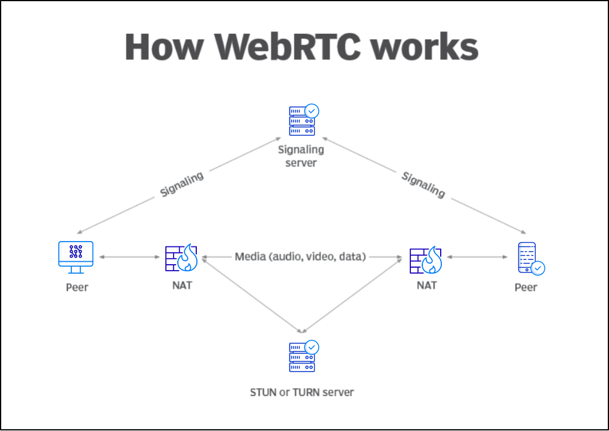

# WebRTC  
## Communication temps réel dans le navigateur

🧠 Objectifs du cours :
- Comprendre comment fonctionne WebRTC
- Connaître les concepts clés (signaling, ICE, STUN…)
- Être capable de développer une démo simple

---
 
## WebRTC c'est quoi ?

> **WebRTC** (Web Real-Time Communication) permet des **communications audio, vidéo et données en temps réel**, **entre navigateurs**, **sans plugin**.

> _C’est comme du Socket.IO, mais sans le serveur : la communication se fait directement entre les clients (P2P)._


---

## Pourquoi WebRTC ?

- Échange audio / vidéo en direct (Discord / Teams...)
- Partage d’écran
- Communication P2P (fichiers, jeux…)
- Sans plugin, 100% navigateur, même sur IOS :yum:

---
## Comment ça marche ?
### Les 3 briques fondamentales

#### 1. `getUserMedia()`
→ Récupère caméra, micro, écran

#### 2. `RTCPeerConnection`
→ Gère la connexion entre pairs

#### 3. `RTCDataChannel`
→ Permet l’échange de données texte ou binaires

---

## Ex. : Récupérer un flux vidéo local


```js
const htmlVideoElement = document.getElementById('videoElement');

navigator.mediaDevices.getUserMedia({ video: true, audio: false })
  .then(stream => {
    videoElement.srcObject = stream;
  });
```


---

## 🧩 Comment fonctionne WebRTC ?

### Étapes simplifiées :

1. Création de la connexion
2. `createOffer()` → Description de session (SDP)
3. Signalisation de l’offre
4. Réponse avec `createAnswer()`
5. Échange d’ICE candidates
6. Connexion P2P établie 🎉

---

## Schéma : WebRTC Peer-to-Peer



---

## 🛰️ Signalisation ?

WebRTC ≠ protocole de signalisation

→ Il faut gérer l’échange initial via WebSocket, HTTP, etc.

Échange :
- Descriptions SDP (`createOffer`, `createAnswer`)
- ICE Candidates (`onicecandidate`)

---

## :snowflake: ICE ?
> **Interactive Connectivity Establishment**
> ICE est le protocole global qui orchestre la connexion entre deux pairs WebRTC.
### Son rôle

- Tester toutes les méthodes possibles pour établir la connexion
- Choisir le meilleur chemin possible (le plus direct et le plus rapide)

ICE essaye différentes "candidates" de connexion :
1. IP locale
2. IP publique (via **STUN**)
3. Relais (via **TURN**)

---

## STUN : À quoi ça sert ?

> **Session Traversal Utilities for NAT**
> STUN permet à un client de connaître son adresse IP publique et son port externe (ceux visibles de l’extérieur du réseau local)
- Découvre l'IP publique
- Essaye une connexion directe

### Fonctionnement :
- Le client envoie une requête à un serveur STUN sur Internet
- Le serveur STUN répond avec l’adresse publique et le port

➡️ Si les deux pairs peuvent se voir par leur IP publique, pas besoin de plus, on peut se connecter.

---
## TURN : À quoi ça sert ?
> **Traversal Using Relays around NAT**
> TURN est une solution de secours si la connexion directe échoue.
- Fait relais si les pairs ne peuvent pas se connecter directement (firewall)
    - Le serveur transmet les données (donc ≠ P2P)

➡️ TURN est une solution de secours moins performante, mais plus fiable dans des environnements sécurisés

---

## Code simplifié : côté émetteur

```js
// Connexion webRTC (peer)
const peer = new RTCPeerConnection();

// Récupération du stream vidéo
const stream = await navigator.mediaDevices.getUserMedia({ video: true });

// Pour chaque flux de la caméra/micro, on l'ajoute à la connexion WebRTC (peer)
stream.getTracks().forEach(track => peer.addTrack(track, stream));

// Création d'une "offre" SDP (Session Description Protocol) décrivant les capacités
// audio/vidéo du client (codecs, résolutions, etc.)
const offer = await peer.createOffer();

// On définit cette offre comme la description locale du pair
//(c'est-à-dire ce qu'on est prêt à envoyer/recevoir)
await peer.setLocalDescription(offer);

// Envoyer `peer.localDescription` via signaling
socket.send(JSON.stringify({ offer: peer.localDescription }));
```

---

## Côté récepteur

```js
const peer = new RTCPeerConnection();
const video = document.getElementById('remote');

// Quand un flux média est reçu depuis l'autre pair,
// on affiche le flux à l'écran
peer.ontrack = (event) => {
  video.srcObject = event.streams[0];
};

// Réception de l'offre SDP de l'autre pair via le serveur de signalisation.
// On la définit comme description distante pour démarrer l'échange.
await peer.setRemoteDescription(offer);

// On génère une "answer" (réponse SDP) à l'offre reçue.
const answer = await peer.createAnswer();

// On définit notre description locale avec la réponse.
await peer.setLocalDescription(answer);

// On envoie notre réponse SDP (localDescription)
// via le serveur de signalisation.
ws.send(JSON.stringify({ answer: peer.localDescription }));

```

---

## RTCDataChannel : données en P2P

```js
const channel = peer.createDataChannel("chat");

channel.onmessage = (e) => console.log("Message reçu:", e.data);

channel.send("Hello peer!");
```

→ Parfait pour des jeux, des chats, ou des fichiers.

---

## Limitations WebRTC

- Signaling obligatoire (hors scope WebRTC)
- Connexions parfois bloquées (firewall, NAT strict)
- Pas adapté aux groupes (utiliser un SFU : mediasoup, Jitsi, etc.)
- Complexité réseau non triviale

---

## Cas d'usage réels

- Google Meet, Jitsi, Discord (voix/vidéo)
- Surveillance à distance (IoT)
- Partage de fichiers entre pairs
- Gaming multi-joueur direct

---

## TP proposé (15 min)

🎯 Objectif : créer une connexion WebRTC entre 2 onglets locaux

✅ Étapes guidées :
- Capture vidéo avec `getUserMedia`
- Utilisation d’un serveur de signalisation WebSocket (fourni)
- Envoi de l’offre + ICE
- Affichage de la vidéo distante
- Gestion d'un chat

Cloner le répo suivant :
https://github.com/EthanGely/webRTC-TP

---

## Évaluation

🎯 Kahoot / Quiz

**Critères évalués :**
- Compréhension de la chaîne de connexion
- Rôle de chaque brique (ICE, STUN, TURN...)

---

## Merci !

👨‍🏫 WebRTC n'est pas magique :  
il repose sur des bases réseau solides, mais il est désormais **accessible dans chaque navigateur moderne**.
